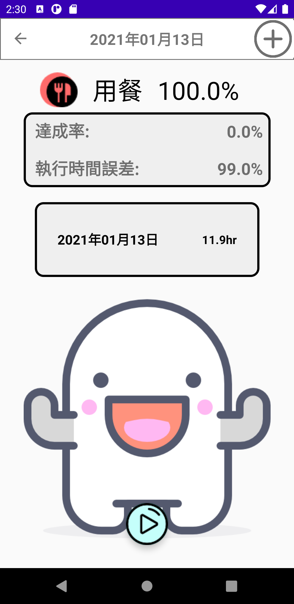
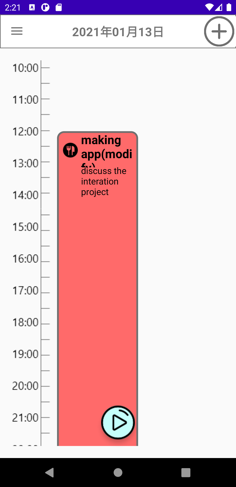

# 時間管家 Time Butler ⏱️

> **「時間比金錢更有價值，因為你永遠賺不到更多的時間。」— Jim Rohn**

## 專案動機

現代人行程繁忙，時常面臨這樣的問題：

- 安排行程後卻難以執行
- 一天下來卻不清楚自己做了什麼
- 缺乏系統性時間記錄與統計

**時間管家** 是一款針對這些痛點設計的時間管理 App，協助使用者規劃日程、追蹤任務執行時間，並提供視覺化的時間使用分析，讓時間使用更有感。

### 📷 使用畫面預覽
<table>
  <tr>
    <td></td>
    <td></td>
    <td></td>
    <td></td>
    <td></td>
    <td></td>
  </tr>
  <tr>
    <td></td>
    <td></td>
    <td></td>
    <td></td>
    <td></td>
    <td></td>
  </tr>
  <tr>
    <td></td>
    <td></td>
    <td></td>
    <td></td>
    <td></td>
    <td></td>
  </tr>
</table>

## 使用者調查簡介

我們透過問卷調查（n=128）分析使用者的需求與習慣：

- 多數人偏好使用手機進行時間管理
- 儘管會記事，卻常因缺乏提醒而難以執行
- 使用者最期待的功能：
  - 快速新增任務
  - 視覺化行事曆
  - 可記錄實際執行時間
  - 統計報表分析

## 目標用戶
- 熟悉基本手機操作的使用者
- 年齡層以 20 ~ 39 歲為主（調查顯示該群最關心時間管理）

## 產品功能概覽

### 首頁
- 顯示當日行程與任務提醒
- 一鍵新增任務
- 底部快速進入計時模式

### 行事曆介面
- 月檢視模式，依顏色標示任務類別
- 點選日期查看當日行程

### 計時系統
- 快速選擇任務開始計時
- 支援暫停／結束操作
- 支援臨時任務計時

### 統計報表
- 顯示任務執行與規劃時間的比例
- 支援日、週、月、年等時間區間
- 可查看各任務類別的詳細數據

## 我們比現有 App 更好的地方

| 功能           | 時間管家 ✅             | 多數市面 App ❌       |
| -------------- | ---------------------- | -------------------- |
| 月曆視覺檢視   | ✅ 有完整月檢視         | ❌ 僅提供單日/列表    |
| 實際計時記錄   | ✅ 支援計時與補登       | ❌ 僅提供行程規劃     |
| 類別與提醒設定 | ✅ 可自訂圖示與提醒     | ❌ 限制較多或無此功能 |
| 統計報表       | ✅ 視覺化分析、切換時間 | ❌ 幾乎沒有統計功能   |

## 團隊成員
| 詹智鈞 | 周哲宇 | 張景淵 | 蔡承哲 | 陳又霆 | 周昱廷 |
| ------ | ------ | ------ | ------ | ------ | ------ |
